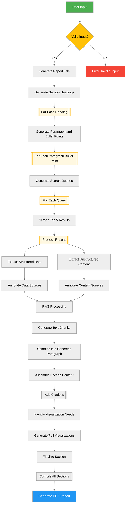

# Finanalyze
## Elevators Pitch
Our financial instrument analysis tool empowers individuals by providing comprehensive research into the current and historical trends of any instrument. Using advanced language models, we deliver clear, objective insights, keeping users informed. You stay in control and make confident financial decisions based on data-driven analysis.
## Project overview
The Finanalyze project is a web application that analyzes financial data using generative models and data analysis. The project focuses on programmatically searching for data, analyzing the data and visualizing it if useful. The user enters a financial instrument (Stock, Bond, Cryptocurrency, etc.) and gets an analysis of the data of that instrument in the form of a report. The program first generates a search term to find the data. Then the data is analyzed and visualized. The user can download the report as a PDF. The target group of the project are individuals who want to support their financial decisions with analysis.
> [!note] Our MVP is limited to top companies listed on either the NYSE or NASDAQ. We will expand to other financial instruments in the future.
## Problem Statement
The problem that our project, Finanalyze, aims to solve is the accessibility of financial analysis for individuals who want to invest in various financial instruments, such as stocks, bonds, and cryptocurrencies. Many investors, especially beginners, struggle to find relevant and reliable information that helps them make informed decisions. This lack of insight can lead to sub optimal investments and financial losses.
## Solution Overview
Our solution is the development of Finanalyze, an accessible web app that offers financial analysis and insights for all kinds of investments. The platform is specifically aimed at individual users who want to improve their investment choices, without having to delve deeply into the financial world or spend a lot of money on expensive analysis tools.
## Workflow
> Each step is a prompt that is given to the LLM. The LLM will generate a response to the prompt. The response is then parsed and used to generate the next prompt. The process continues until the report is generated.

> We use some keywords to indicate the type of prompt. `once` is used to indicate that the prompt is only given once. `each` is used to indicate that the prompt is given for each item in a list. Since we mostly work with strings in this workflow, we don't specify that variables are strings. We only specify the type if it is not a string, e.g. `boolean` or `[]`-suffix for a list.

> This process starts when the user clicks the `Generate`-button on the web app. At which point the user's input is passed to the backend where this flow starts.

> This section describes the flow of a user's request through the generation process. This section does not discuss UX/UI, API, or other technical details. It is an overview of the LLM/RAG workflow.

